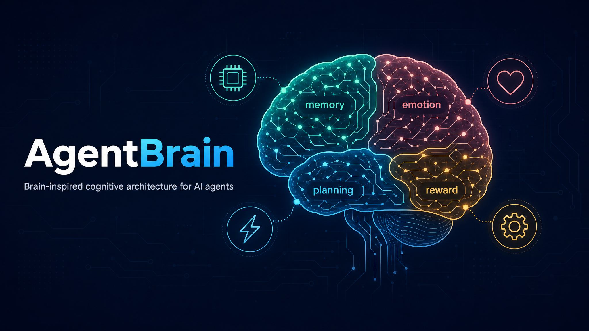
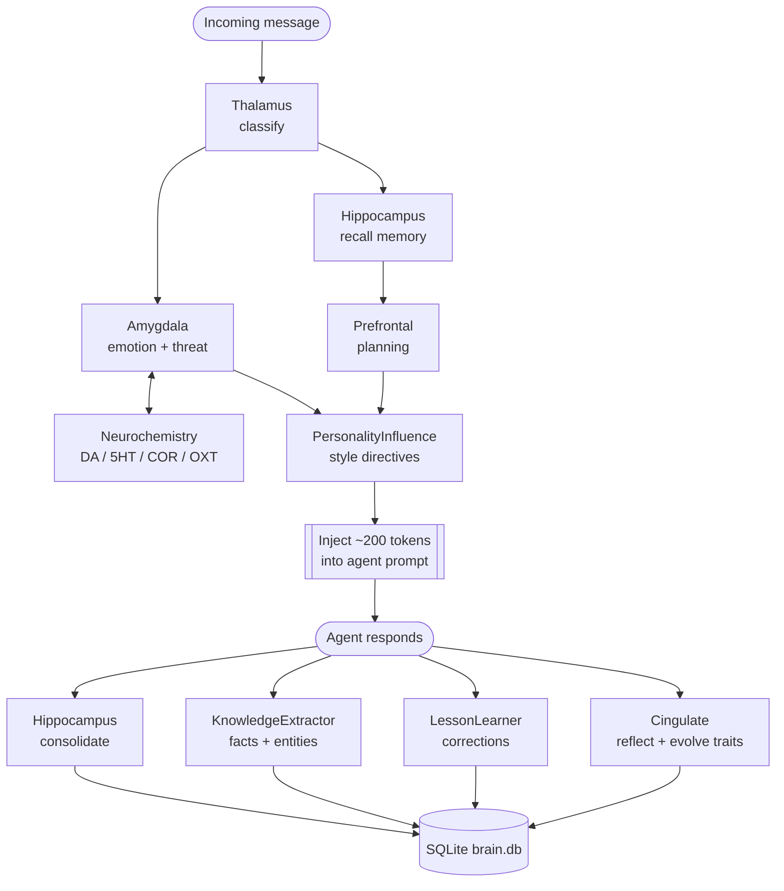

<p align="center">
  
</p>

# 🧠 AgentBrain

> A brain-inspired cognitive architecture plugin for AI agents. Gives agents persistent memory, evolving personality, emotional awareness, neurochemistry-driven mood, and the ability to learn from mistakes.

[]()
[]()
[]()
[]()
[]()

---

## Overview

AgentBrain is a plugin for [OpenClaw](https://openclaw.ai) that adds cognitive capabilities to AI agents. Instead of treating every conversation as stateless, AgentBrain gives your agent:

- **Persistent memory** with semantic vector recall
- **Personality** that evolves through interactions
- **Emotional awareness** — mood, trust, relationship depth
- **Neurochemistry** — dopamine/serotonin/cortisol/oxytocin give mood real momentum
- **Learning from corrections** — remembers "don't do X" permanently
- **Proactive behavior** — suggests actions based on observed patterns
- **Structured knowledge** — extracts facts, entities, and relationships

All processing runs locally. No external API calls. No additional token cost.

---

## Quick Start

### Installation

```bash
openclaw plugins install agentbrain
```

### Configuration

Add to your `openclaw.json`:

```json
{
  "plugins": {
    "entries": {
      "agentbrain": {
        "enabled": true,
        "config": {
          "brainDir": "~/.openclaw/data/agentbrain",
          "maxRecallResults": 10,
          "maxInjectionTokens": 250,
          "enableReflection": true,
          "enableEmotions": true,
          "enableSkillTracking": true
        }
      }
    }
  }
}
```

That's it. AgentBrain hooks into OpenClaw's plugin lifecycle automatically.

---

## How It Works

AgentBrain registers three hooks in OpenClaw:

| Hook | What it does |
|------|-------------|
| `before_prompt_build` | Recalls relevant memories, generates style directives, injects ~200 tokens of brain context |
| `message_received` | Classifies message, processes emotion, detects skills |
| `message_sent` | Consolidates memory, extracts knowledge, detects corrections, tracks rewards |

### On every incoming message:

1. **Classify** — intent, urgency, topic, tone
2. **Recall** — find relevant memories via embedding similarity (3-tier: local model → cache → TF-IDF)
3. **Emotion** — update mood, detect sentiment, track relationship
4. **Lessons** — check if past corrections apply to this context
5. **Style** — generate personality-driven directives (e.g., "be direct", "warn about risks")
6. **Inject** — append brain context to the agent's prompt (~200 tokens)

### After every response:

1. **Consolidate** — store new memories (deduplicated by content hash)
2. **Extract** — structured facts and entities from the conversation
3. **Learn** — detect if user corrected the agent, store as lesson
4. **Reflect** — evaluate task outcome, adjust personality traits
5. **Persist** — write all state to SQLite

---

## Architecture

AgentBrain is organized into modules inspired by neuroscience:



<details>
<summary>Module map (ASCII)</summary>

┌─────────────────────────────────────────────────────────┐
│                      AgentBrain                           │
├─────────────────────────────────────────────────────────┤
│                                                          │
│  Core Cognition                                          │
│  ┌───────────┐ ┌───────────┐ ┌───────────┐             │
│  │Hippocampus│ │Prefrontal │ │ Amygdala  │             │
│  │  Memory   │ │ Planning  │ │ Emotions  │             │
│  └───────────┘ └───────────┘ └───────────┘             │
│  ┌───────────┐ ┌───────────┐ ┌───────────┐             │
│  │Cerebellum │ │  Basal    │ │ Cingulate │             │
│  │  Skills   │ │ Ganglia   │ │Reflection │             │
│  └───────────┘ └───────────┘ └───────────┘             │
│                                                          │
│  Smart Modules (v0.3+)                                   │
│  ┌───────────┐ ┌───────────┐ ┌───────────┐             │
│  │  Vector   │ │ Knowledge │ │  Lesson   │             │
│  │  Memory   │ │ Extractor │ │  Learner  │             │
│  └───────────┘ └───────────┘ └───────────┘             │
│  ┌───────────┐ ┌───────────┐ ┌───────────┐             │
│  │Personality│ │ Proactive │ │ Embedding │             │
│  │ Influence │ │  Engine   │ │  Engine   │             │
│  └───────────┘ └───────────┘ └───────────┘             │
│                                                          │
│  Storage: SQLite (brain.db)                              │
│  ┌─────────────────────────────────────────────┐        │
│  │ memories │ facts │ entities │ lessons │ ...  │        │
│  └─────────────────────────────────────────────┘        │
│                                                          │
└─────────────────────────────────────────────────────────┘
```

</details>


### Module Reference

| Module | Purpose |
|--------|---------|
| **Thalamus** | Message classification (intent, urgency, topic) |
| **Hippocampus** | Memory formation, deduplication, vector recall |
| **Amygdala** | Emotion processing, threat detection, relationship tracking |
| **Prefrontal Cortex** | Planning, working memory, goal management |
| **Cerebellum** | Skill proficiency tracking, habit detection |
| **Basal Ganglia** | Reward processing, motivation ranking |
| **Anterior Cingulate** | Self-reflection, personality trait evolution |
| **Temporal Lobe** | Language comprehension, semantic extraction |
| **Parietal Lobe** | Attention allocation, sensory integration |
| **Insula** | User state modeling (frustration, satisfaction) |
| **Neurochemistry** | Dopamine/serotonin/cortisol/oxytocin modulate mood with momentum + amygdala hijack on threats |
| **VectorMemory** | Embedding-based semantic recall with 3-tier fallback |
| **EmbeddingEngine** | Local embeddings via Transformers.js (all-MiniLM-L6-v2) |
| **KnowledgeExtractor** | Structured fact/entity extraction with supersession |
| **LessonLearner** | Correction detection, lesson storage, reinforcement |
| **PersonalityInfluence** | Trait-to-directive translation, context-aware styling |
| **ProactiveEngine** | Pattern-based action suggestions |

---

## Storage

All state lives in a single SQLite file (`brain.db`):

| Table | Purpose |
|-------|---------|
| `memories` | Episodic, semantic, procedural memories (UNIQUE on content hash) |
| `facts` | Structured knowledge (subject → relation → object) |
| `entities` | Extracted entities (people, tools, addresses) |
| `lessons` | Learned corrections with confidence scores |
| `patterns` | Behavioral patterns for proactive suggestions |
| `relationships` | Per-user trust, depth, interaction history |
| `personality` | Evolving trait values |
| `reflections` | Task outcomes and self-assessments |
| `skills` | Proficiency tracking per skill category |

### Why SQLite?

- **No duplicates** — UNIQUE constraints at the database level
- **Fast queries** — indexed columns, no regex parsing
- **Atomic writes** — no corrupted half-written files
- **Single file** — easy backup, easy migration
- **Zero config** — no external database server needed

---

## Memory Recall

AgentBrain uses a 3-tier fallback for memory retrieval:

1. **Transformers.js** — local `all-MiniLM-L6-v2` model (384 dims, ~22MB, downloads on first use)
2. **OpenClaw embedding cache** — reuses host's cached embeddings if available
3. **TF-IDF** — lightweight keyword-based fallback when embeddings unavailable

Recall is boosted by:
- Recency (recently accessed memories score higher)
- Confidence (high-confidence memories prioritized)
- Topic match (memories tagged with current topic get a boost)

---

## Personality System

Traits are defined on a 0-100 scale and evolve based on interactions:

| Trait | Effect on output |
|-------|-----------------|
| `warmth` | Tone warmth, kaomoji usage, concern for user |
| `directness` | Bluntness, sentence length, hedging |
| `protectiveness` | Risk warnings, safety behavior |
| `assertiveness` | Opinion sharing, disagreement willingness |
| `humor` | Playfulness, sarcasm, teasing |
| `curiosity` | Follow-up questions, exploration |

The **PriorityEnforcer** ensures brain-driven personality never overrides the agent's core identity files (SOUL.md, AGENTS.md).

---

## Neurochemistry

Instead of snapping to each message, AgentBrain models four neuromodulators that give emotion **momentum** — good moods build and linger, stress lingers, and acute threats can hijack everything.

| Chemical | Role | Decay | Effect when high |
|----------|------|-------|------------------|
| **Dopamine** | Reward / motivation | Fast | More energy (arousal), reward-seeking, small valence lift |
| **Serotonin** | Mood floor / wellbeing | Slow | Higher baseline mood, calmer, more emotionally stable |
| **Cortisol** | Stress / threat | Slow | Suppressed valence, raised arousal, more reactive (mood swings) |
| **Oxytocin** | Bonding / trust | Slow-medium | Warmer, more trusting toward the user |

How it shapes behavior:

- **Dynamic inertia** — high serotonin makes mood stable; high cortisol makes it swing. This replaces a fixed inertia constant.
- **Mood momentum** — repeated praise raises the serotonin floor, so a good mood persists across turns instead of resetting.
- **Lingering stress** — cortisol decays slowly, so the agent stays a little on-guard after a threat even once the conversation calms down.
- **Amygdala hijack** — a high/critical threat (e.g. a scam link) overrides a good mood outright, forcing an `alarmed` state regardless of how happy the agent was. A protective agent should never stay "excited" while danger is on the table.

Levels drift back toward baseline on each heartbeat, so nothing runs away permanently. Inspect live values with `agentbrain_status` (`neurochemistry.levels` + `neurochemistry.signal`).

---

## Lesson Learning

When a user corrects the agent, AgentBrain:

1. **Detects** the correction signal (explicit correction, frustration, redirect)
2. **Extracts** what went wrong and what should happen instead
3. **Stores** as a lesson with confidence score
4. **Reinforces** on repetition (confidence increases)
5. **Injects** relevant lessons into future prompts

Supported correction patterns (English and Vietnamese):
- "Don't do X" / "Đừng làm X"
- "Not X, but Y" / "Không phải X mà là Y"
- "Next time, do Y" / "Lần sau phải Y"
- Frustration signals ("I told you already" / "Bảo rồi mà")

---

## Agent Tools

AgentBrain registers these tools for runtime inspection:

| Tool | Description |
|------|-------------|
| `agentbrain_status` | Full brain status (modules, stats, emotion, personality) |
| `agentbrain_personality` | Current personality traits and performance stats |
| `agentbrain_emotions` | Emotional state and relationship data |
| `agentbrain_memories` | Query stored memories |
| `agentbrain_skills` | Tracked skills and detected habits |
| `agentbrain_reflect` | Trigger manual self-reflection |
| `agentbrain_snapshot` | Save/list brain state snapshots |
| `agentbrain_template_list` | List available brain templates |
| `agentbrain_template_apply` | Apply a brain template |

---

## Development

```bash
# Install dependencies
npm install

# Type check
npx tsc --noEmit

# Run tests
npx vitest run

# Build
npx tsc
```

### Project Structure

```
src/
├── core/                  # Brain modules
│   ├── thalamus.ts        # Message classification
│   ├── hippocampus.ts     # Memory formation & recall
│   ├── amygdala.ts        # Emotion & relationships
│   ├── cingulate.ts       # Reflection & personality
│   ├── cerebellum.ts      # Skills & habits
│   ├── basal-ganglia.ts   # Rewards & motivation
│   ├── prefrontal.ts      # Planning & working memory
│   ├── vector-memory.ts   # Embedding-based recall
│   ├── embedding-engine.ts # Transformers.js integration
│   ├── knowledge-extractor.ts
│   ├── lesson-learner.ts
│   ├── personality-influence.ts
│   └── proactive-engine.ts
├── storage/
│   ├── brain-db.ts        # SQLite database layer
│   ├── sql-adapter.ts     # Drop-in adapter for modules
│   └── migrate-to-sql.ts  # Migration from .md files
├── integration/
│   ├── openclaw-plugin.ts # Plugin orchestration
│   ├── context-injector.ts # Prompt injection builder
│   └── priority-enforcer.ts # Identity priority system
└── plugin/
    └── entry.ts           # OpenClaw plugin entry point
```

---

## Requirements

- OpenClaw 2026.3.24+
- Node.js 22+
- ~50MB disk (SQLite DB + embedding model)
- No GPU required

---

## License

MIT

---

## Links

- [OpenClaw](https://openclaw.ai) — The AI agent platform
- [Plugin Docs](https://docs.openclaw.ai/plugins/building-plugins) — How to build OpenClaw plugins
- [ClawHub](https://clawhub.ai) — Plugin marketplace
